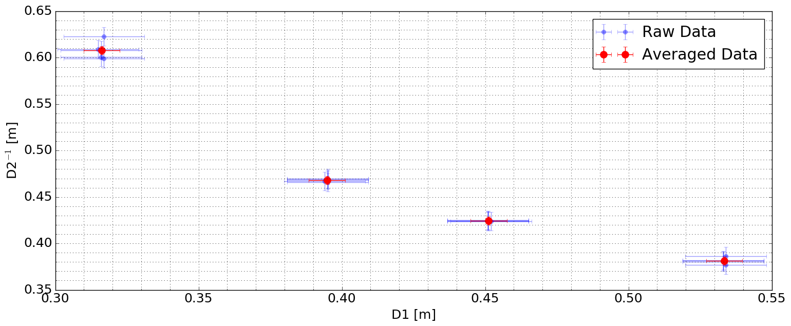

Lab 3 for _Observational Astronomy Lab_, thin lens optics.

Click [HERE](A3.pdf) to see report.

Below is the code for the analyses

## Libraries


```python
import numpy as np
import matplotlib.pyplot as plt
from pylab import rcParams

from uncertainties import ufloat
from uncertainties.umath import *
from uncertainties import unumpy

```

## Directory Tree


```python
main_dir = "/Users/kaimibk/Desktop/ASTR300L/A3/"
in_file = main_dir+"A3_data.txt"
out_dir = main_dir
```

## Loading Data


```python
'''
D1 : obj distance
D2 : Image Dist
D3 : Total Dist
'''

data = np.loadtxt(in_file,delimiter=',')

index = data[:,0]
D1 = unumpy.uarray(data[:,1], data[:,2])
D2 = unumpy.uarray(data[:,3], data[:,4])
#D3 = unumpy.uarray(data[:,6], data[:,7])
```

## Calculating Focal Length


```python
#f = io / (i+o)
D1_1 = (sum(D1[0:5])/5.0, 
        sum(D1[5:10])/5.0, 
        sum(D1[10:15])/5.0, 
        sum(D1[15:20])/5.0)

D2_1 = (sum(D2[0:5])/5.0, 
        um(D2[5:10])/5.0, 
        sum(D2[10:15])/5.0, 
        sum(D2[15:20])/5.0)
```


```python
focal = fsum((D1*D2)/(D1+D2))/len(D1)

print("Focal Length: %s [m]")%focal
```

    Focal Length: 0.2158+/-0.0011 [m]


```python
plt.clf()

plt.minorticks_on()

rcParams['figure.figsize'] = 18, 7
rcParams.update({'font.size': 18})

plt.errorbar(unumpy.nominal_values(D1), unumpy.nominal_values(D2), 
             xerr=unumpy.std_devs(D1), yerr=unumpy.std_devs(D2), fmt='.', 
             ms=12, label="Raw Data", alpha=0.4)

plt.errorbar(unumpy.nominal_values(D1_1), unumpy.nominal_values(D2_1), 
             xerr=unumpy.std_devs(D1_1), yerr=unumpy.std_devs(D2_1), fmt='.', 
             ms=20, label="Averaged Data", color="r")


plt.grid(b=True, which='minor', linestyle=':')
plt.grid(b=True, which='major', linestyle=':')
plt.ylabel("D2$^{-1}$ [m]")
plt.xlabel("D1 [m]")
plt.legend()

plt.show()
```



