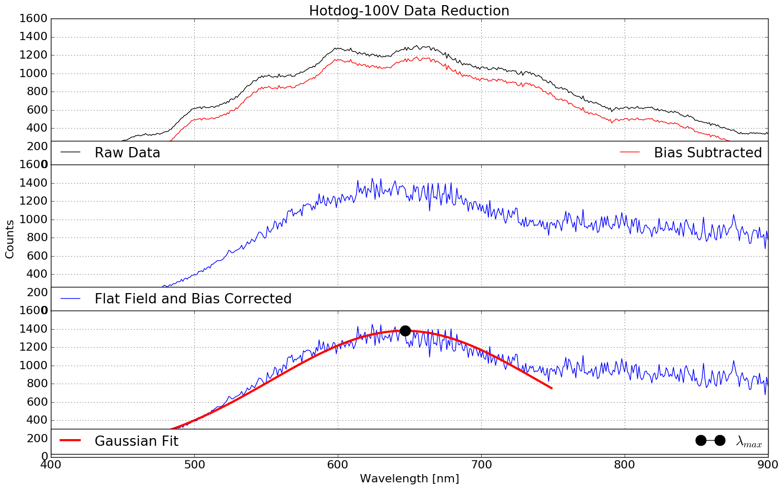
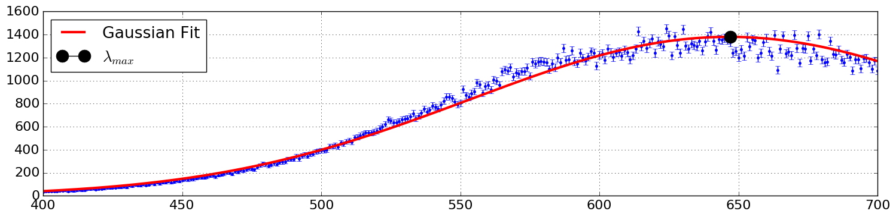
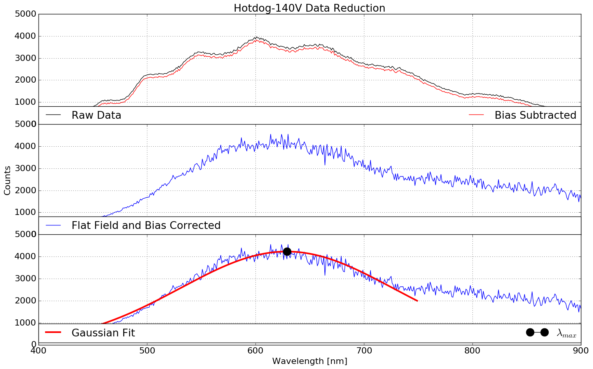
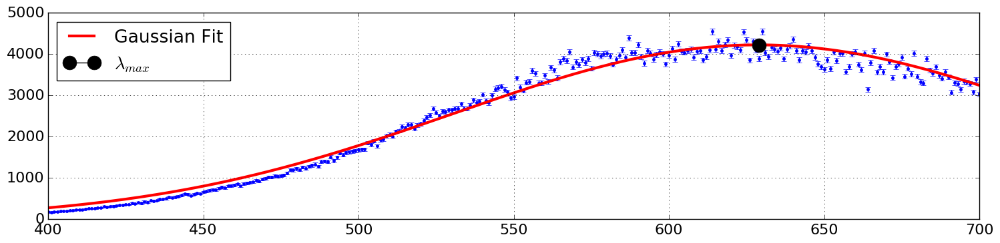

Lab 4 for Observational Astronomy Lab, CCD Images and Spectroscopy

Click [HERE](A4.pdf) to see report.

- - -


```python
import numpy as np
import matplotlib.pyplot as plt
from scipy.optimize import curve_fit
from pylab import rcParams
from uncertainties import ufloat
#import numpy.polynomial.polynomial as poly


rcParams['figure.figsize'] = 18, 11
rcParams.update({'font.size': 16})
```


## Directories


```python
main_dir = "/Users/kaimibk/Desktop/ASTR300L/A4/"
spectra_files = main_dir+"spectra_files/calibration/"
plot_dir = main_dir+"plots/"

data_dir = main_dir+"spectra_files/incandescent/"
quartz_dir = spectra_files+"quartz/"
darks_dir = spectra_files+"darks/"
background_dir = spectra_files+"background/"
```


```python
def norm(in_array):
    return (in_array - min(in_array))/(max(in_array)-min(in_array))

def quad(x,a,b,c,d,e):
    return a*x**4 + b*x**3 + c*x**2 + d*x + e

def gaus(x,a,x0,sigma):
    return a*np.exp(-(x-x0)**2/(2*sigma**2))

def str_function(coefficients):
    return ("$y=({}) exp(-x-({})^2)/(2*({})^2)$").format(*([round(coefficients[i],2) for i in range(len(coefficients))]))

#def str_function(coefficients):
#    return ("$y= ({}) x^4 + ({}) x^3 + ({}) x^2 + ({}) x + ({})$").format(*([round(coefficients[i],2) for i in range(len(coefficients))]))
    
#function_100v = ("$y= {} x + {} x + {} x + {} x + {}$").format(*([round(popt[i],2) for i in range(len(popt))]))
wien = (2.898*10**6)
```

## Load Data Flats


```python
flat_cond = np.genfromtxt(quartz_dir+"quartz_lamp-no_condenser.txt",
                          skip_header=17, delimiter=",", skip_footer=1,
                         dtype=None)
## -- Raw
cond_wave = flat_cond[:,0]
cond_count = flat_cond[:,1]

## -- Normalized
cond_count_norm = norm(cond_count)
```

```python
flat_spec = np.genfromtxt(quartz_dir+"quartz_lamp-specs.tsv",
                          skip_header=1, delimiter="\t", skip_footer=1)
## -- Raw
spec_wave = flat_spec[50:701,0]
spec_count = flat_spec[50:701,1]

## -- Normalized
spec_count_norm = norm(spec_count)
```


## Produce Flat


```python
flat_count = cond_count_norm / spec_count_norm
```

## Load Hotdog-100V Raw Data


```python
raw_data = np.genfromtxt(data_dir+"hotdog-100V.txt",
                        skip_header=5, dtype=None)

raw_count = raw_data[:,1]

## -- Bias Subtract
count_corr = raw_count - min(raw_count)
```


```python
data_final = count_corr / flat_count
```


```python
wave_trim = cond_wave[50:400]
count_trim = data_final[50:400]

count_trim_err = np.sqrt(count_trim)
```


```python
popt, pcov = curve_fit(gaus, wave_trim, count_trim, p0=[max(count_trim), np.mean(count_trim), np.std(count_trim)], sigma=np.sqrt(count_trim))
```


```python
count_max = wave_trim[np.argmax(gaus(wave_trim, *popt))]
count_max_err = pcov[1][1]
x = (ufloat(count_max, count_max_err))
print(x)
print("The temperature of hotdog-100V is %s [K]")%(wien/x)
```

    647.0+/-0.4
    The temperature of hotdog-100V is 4479.1+/-2.9 [K]


```python
plt.clf()
f, (ax1, ax2, ax3) = plt.subplots(3, sharex=True, sharey=True)
ax1.plot(cond_wave, raw_count, color="k", label="Raw Data")
ax1.plot(cond_wave, count_corr, color="r", label="Bias Subtracted")
ax1.set_title('Hotdog-100V Data Reduction')
ax2.plot(cond_wave, data_final, color="b", label="Flat Field and Bias Corrected")
ax3.plot(cond_wave, data_final, color="b")
ax3.plot(wave_trim, gaus(wave_trim, *popt), label="Gaussian Fit", lw=3, color="r")

ax3.plot(count_max, max(gaus(count_trim, *popt)), markersize=30, color="k", marker=".", label="$\lambda_{max}$")

#ax3.axvline(x=count_max, color="g", lw=4, label="$\lambda_{max}$")


#Fine-tune figure; make subplots close to each other and hide x ticks for
#all but bottom plot.
f.subplots_adjust(hspace=0)
plt.setp([a.get_xticklabels() for a in f.axes[:-1]], visible=False)
ax1.legend(bbox_to_anchor=(0., 0.06, 1., .102), loc=2,
           ncol=2, mode="expand", borderaxespad=0.)

ax2.legend(bbox_to_anchor=(0., 0.06, 1., .102), loc=2,
           ncol=1, mode="expand", borderaxespad=0.)

ax3.legend(bbox_to_anchor=(0., 0.09, 1., .102), loc=2,
           ncol=3, mode="expand", borderaxespad=0.)

ax3.set_xlabel("Wavelength [nm]")
ax2.set_ylabel("Counts")
plt.xlim(400, 900)
ax1.grid()
ax2.grid()
ax3.grid()
#f.legend((ax1,ax2,ax3), ("Raw and Bias Subtracted Data", "Flat Field and Bias Corrected", "Corrected with Fit"),"upper left")
f.savefig(plot_dir+"100V_stacked.png", bbox_inches="tight")
plt.show()


```


    <matplotlib.figure.Figure at 0x110861c50>





```python
rcParams['figure.figsize'] = 18, 4
plt.clf()

plt.errorbar(cond_wave, data_final, color="b", fmt='.', yerr=np.sqrt(data_final))

plt.plot(wave_trim, gaus(wave_trim, *popt), label="Gaussian Fit", lw=3, color="r")
plt.plot(count_max, max(gaus(count_trim, *popt)), markersize=30, color="k", marker=".", label="$\lambda_{max}$")

plt.grid()
plt.legend(loc=2)

plt.xlim(400, 700)

plt.savefig(plot_dir+"100V_gauss.png", bbox_inches="tight")
plt.show()

```





## Hotdog-140V


```python
rcParams['figure.figsize'] = 18, 11

raw_data = np.genfromtxt(data_dir+"hotdog-140V.txt",
                        skip_header=5, dtype=None)

raw_count = raw_data[:,1]

## -- Bias Subtract
count_corr = raw_count - min(raw_count)
```


```python
data_final = count_corr / flat_count
```

    /Users/kaimibk/anaconda2/lib/python2.7/site-packages/ipykernel/__main__.py:1: RuntimeWarning: divide by zero encountered in divide
      if __name__ == '__main__':


```python
wave_trim = cond_wave[50:400]
count_trim = data_final[50:400]
```


```python
popt, pcov = curve_fit(gaus, wave_trim, count_trim, p0=[max(count_trim), np.mean(count_trim), np.std(count_trim)])
```

```python
count_max = wave_trim[np.argmax(gaus(wave_trim, *popt))]
count_max_err = pcov[1][1]

x = (ufloat(count_max, count_max_err))
print(x)
print("The temperature of hotdog-100V is %s [K]")%(wien/x)
```

    629.0+/-0.4
    The temperature of hotdog-100V is 4607.3+/-2.7 [K]


```python
plt.clf()
f, (ax1, ax2, ax3) = plt.subplots(3, sharex=True, sharey=True)
ax1.plot(cond_wave, raw_count, color="k", label="Raw Data")
ax1.plot(cond_wave, count_corr, color="r", label="Bias Subtracted")
ax1.set_title('Hotdog-140V Data Reduction')
ax2.plot(cond_wave, data_final, color="b", label="Flat Field and Bias Corrected")
ax3.plot(cond_wave, data_final, color="b")
ax3.plot(wave_trim, gaus(wave_trim, *popt), label="Gaussian Fit", lw=3, color="r")

ax3.plot(count_max, max(gaus(count_trim, *popt)), markersize=30, color="k", marker=".", label="$\lambda_{max}$")

#ax3.axvline(x=count_max, color="g", lw=4, label="$\lambda_{max}$")


#Fine-tune figure; make subplots close to each other and hide x ticks for
#all but bottom plot.
f.subplots_adjust(hspace=0)
plt.setp([a.get_xticklabels() for a in f.axes[:-1]], visible=False)
ax1.legend(bbox_to_anchor=(0., 0.06, 1., .102), loc=2,
           ncol=2, mode="expand", borderaxespad=0.)

ax2.legend(bbox_to_anchor=(0., 0.06, 1., .102), loc=2,
           ncol=1, mode="expand", borderaxespad=0.)

ax3.legend(bbox_to_anchor=(0., 0.09, 1., .102), loc=2,
           ncol=3, mode="expand", borderaxespad=0.)

ax3.set_xlabel("Wavelength [nm]")
ax2.set_ylabel("Counts")
plt.xlim(400, 900)
ax1.grid()
ax2.grid()
ax3.grid()
#f.legend((ax1,ax2,ax3), ("Raw and Bias Subtracted Data", "Flat Field and Bias Corrected", "Corrected with Fit"),"upper left")
f.savefig(plot_dir+"140V_stacked.png", bbox_inches="tight")
plt.show()


```


    <matplotlib.figure.Figure at 0x114a6e850>





```python
rcParams['figure.figsize'] = 18, 4
plt.clf()

plt.errorbar(cond_wave, data_final, color="b", fmt='.', yerr=np.sqrt(data_final))

plt.plot(wave_trim, gaus(wave_trim, *popt), label="Gaussian Fit", lw=3, color="r")
plt.plot(count_max, max(gaus(count_trim, *popt)), markersize=30, color="k", marker=".", label="$\lambda_{max}$")

plt.grid()
plt.legend(loc=2)

plt.xlim(400, 700)

plt.savefig(plot_dir+"140V_gauss.png", bbox_inches="tight")
plt.show()

```




