Lab 5 for _Observational Astronomy Lab_, aperture photometry.

Click [HERE](A5.pdf) to see report.

Below is the code for the analyses...

- - -


Kaimi Kahihikolo
ASTR 300L : Assignment # 5
Updated: 9 Nov. 2017

## Libraries
```python
import numpy as np
import os

import matplotlib.pyplot as plt
from pylab import rcParams
from matplotlib import patches

from astropy.io import fits
from astropy.coordinates import SkyCoord
from astropy import wcs
from astropy.time import Time

from uncertainties import ufloat
from uncertainties.umath import *
from uncertainties import unumpy

plt.clf()
rcParams.update({'font.size': 9})
```

Outline of analyses:
  * Load Raw Image
  * scale image 
    * image[> 65000] = 1
  * Create viewable image
    * np.log10(image)
  * Locate target (convert RA/Dec to pix)
  * Select aperature size
     * apData = rawData[Y:Y+dY, X:X+dX]
  * Sum counts in aperature
  * Subtract background counts
  * Record database date/time
  * Repeat

## Directories

```python
main_dir = "/Users/kaimibk/Desktop/ASTR300L/A5/"
spectra_files = main_dir+"Spectra/"
output_dir = main_dir+"output2/"

if not os.path.exists(output_dir):
    os.makedirs(output_dir)
```
## Constants
```python
target_loc = SkyCoord("16h14m20.3s -19d6m48.1s")
print("The target RA and DEC is: {}, {}").format(target_loc.ra.deg, 
                                                 target_loc.dec.deg)

ref_loc = SkyCoord("16h14m20.912s -19d06m04.70s")
print("The Reference RA and DEC is: {}, {}").format(ref_loc.ra.deg, 
                                                 ref_loc.dec.deg)
ref_mag = 13.5

## -- Aperture
ap_pix = 15.0

```

    The target RA and DEC is: 243.584583333, -19.1133611111
    The Reference RA and DEC is: 243.587133333, -19.1013055556


```python
def background(data, xstart, ystart, length):
    return (data[xstart:xstart+length, 
                 ystart:ystart+length], 
                xstart, 
                ystart, 
                length)
```


```python
def find_star(input_image, output_image, target): 
    plt.clf()
    
    hdulist = fits.open(input_image)    
    
        ## -- Extracting .fits Header
    header = hdulist[0].header
    
    obs_date = header["DATE"]
    gain = header["GAIN"]
    
        ## -- WCS to find target
    w = wcs.WCS(header)
          
    pixcrd = wcs.utils.skycoord_to_pixel(target, w)
        
            ## -- Correcting Coords in LSC images (manually)
    if input_image == (spectra_files+"lsc1m004-fl04-20140624-0138-e90.fits"):
        pixcrd = np.array([pixcrd[0]+55.0, pixcrd[1]-35.0])
    
    elif input_image == (spectra_files+"lsc1m004-fl04-20140622-0136-e90.fits"):
        pixcrd = np.array([pixcrd[0]+35.0, pixcrd[1]-35.0])
    else:
        pixcrd = pixcrd
          
        ## -- Extract Data
    image = hdulist[0].data

        ## -- Image Corrections
    image = np.array(image)-np.min(image)+1.0
    
        ## -- Measuring background
    background_func = background(image, 350, 1200, 200)
    background_region = background_func[0]
    
    background_val = np.mean(background_region)
    
        ## -- Aperature
    ap_region = np.array(image[(pixcrd[1]-ap_pix):(pixcrd[1]+ap_pix), 
                   (pixcrd[0]-ap_pix):(pixcrd[0]+ap_pix)])
    
    
    raw_flux = np.sum(ap_region)

        ## -- Aperture * gain - background
    flux_corr = ufloat(np.sum(ap_region - background_val)*gain,
                      np.sqrt(np.sum(ap_region - background_val)*gain))

    
    log_image = np.log10(image)
    
    log_image[log_image > 65000] = 1
    
    
    
    fig, axarr = plt.subplots(1,2)


        ## -- Aperture Region
    axarr[1].imshow(np.log10(ap_region), "gray")
    axarr[1].set_title("Aperture Region")
    
        ## -- Show full region
    axarr[0].set_title("Whole Region")
    axarr[0].imshow(log_image, "gray")
    axarr[0].add_patch(patches.Rectangle((pixcrd[0]-ap_pix, 
                                          pixcrd[1]-ap_pix),
                                   2.0*ap_pix,
                                   2.0*ap_pix,
                                   fill=False,
                                   edgecolor="red"))
    
    axarr[0].add_patch(patches.Rectangle((background_func[1],background_func[2]),
                               background_func[3],
                               background_func[3],
                               fill=False,
                               edgecolor="blue"))
    plt.setp(axarr[0].get_xticklabels(), rotation=30, 
                         horizontalalignment='right')
    plt.suptitle(str(header["SITE"])+" "+str(obs_date)+" \n")
    
    fig.tight_layout()
    fig.savefig(output_image+"_plot_2.png", dpi=300)
    plt.show() ; plt.close()
    
    return flux_corr
    
```


```python
times = []
mags = []

for filename in os.listdir(spectra_files):
    if filename.endswith(".fits"):
        print("Image: {}").format(filename)
    
        hdulist = fits.open(spectra_files+filename)
        header = hdulist[0].header
        
        obs_date = header["MJD-OBS"]
        
        flux_target = find_star(spectra_files+filename, output_dir+filename, target_loc)
        flux_ref = find_star(spectra_files+filename, output_dir+filename, ref_loc)
        
        m_target = -2.5*log(flux_target/flux_ref, 10) + ref_mag
        print(header["SITE"])
        #print("{} & {} & {} \\\\").format(obs_date, 
        #                                unumpy.nominal_values(flux_target),
        #                               m_target)
        #print("\t Observation Time: {}").format(obs_date)
        #print("\t Correcred Flux: {}").format(flux_target)
        #print(" \t Target Magnitude: {} \n").format(m_target)
        
        mags.append(m_target)
        times.append(obs_date)

    else:
        continue

```


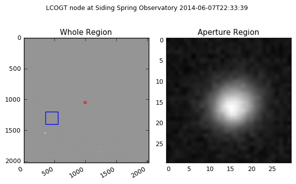


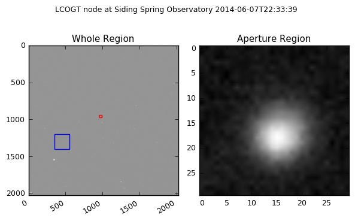


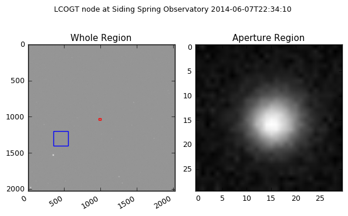


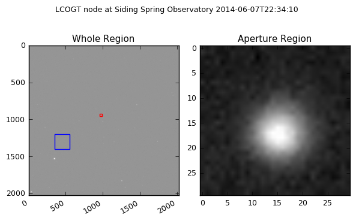


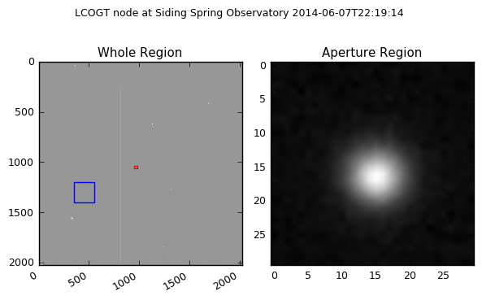


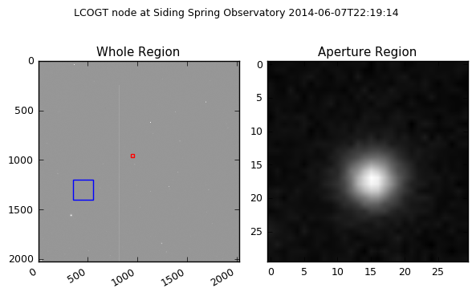


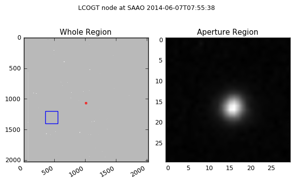


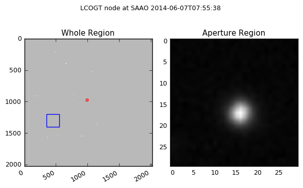


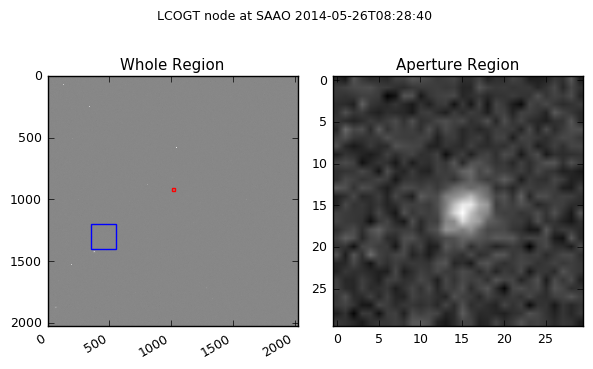


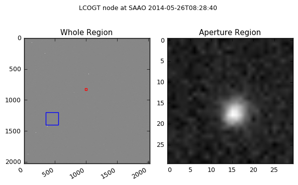


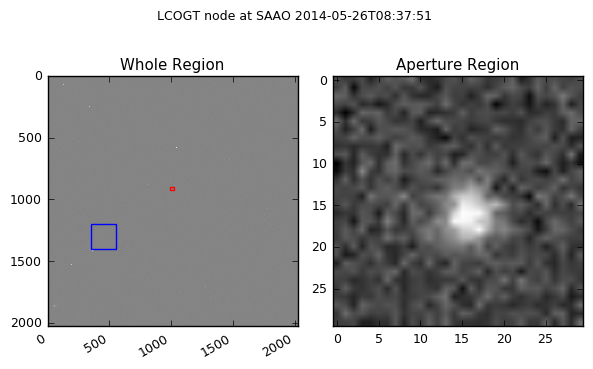


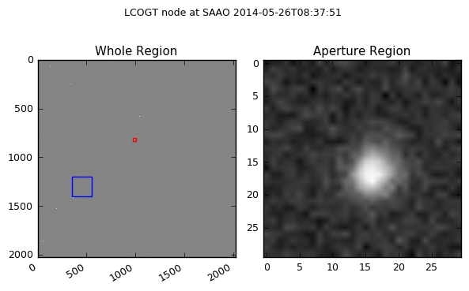


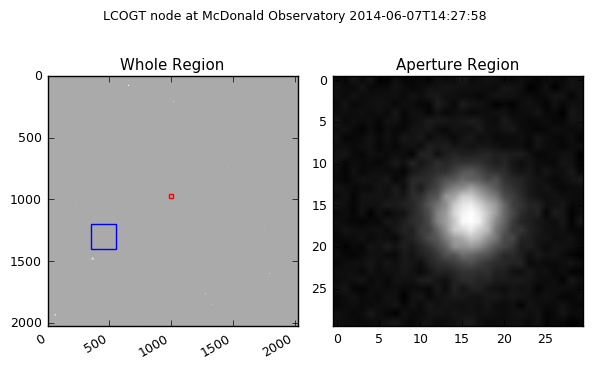


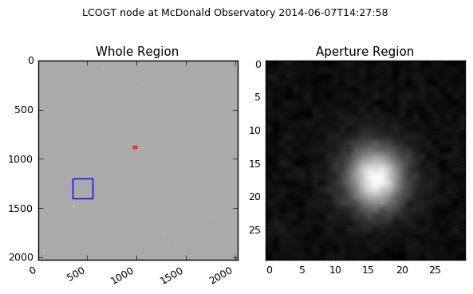


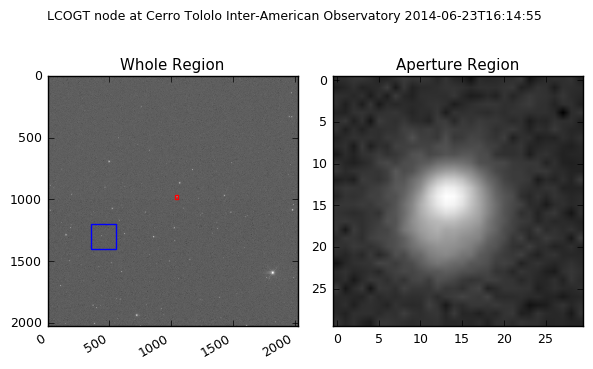


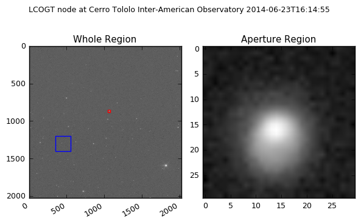


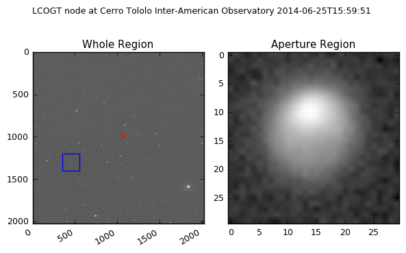


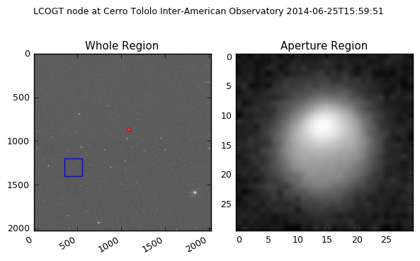


- - -

```python
plt.clf()

[plt.axvline(x=i, color="grey", alpha=0.4, linestyle=":") for i in times]

plt.errorbar(times[0:4], unumpy.nominal_values(mags[0:4]), 
             yerr=unumpy.std_devs(mags[0:4]), fmt='.',
            color="b", label="Siding Spring Observatory")
plt.errorbar(times[4:7], unumpy.nominal_values(mags[4:7]), 
             yerr=unumpy.std_devs(mags[4:7]), fmt='.',
            color="r", label="SAAO")
plt.errorbar(times[7], unumpy.nominal_values(mags[7]), 
             yerr=unumpy.std_devs(mags[7]), fmt='.',
            color="g", label="McDonald")
plt.errorbar(times[8:10], unumpy.nominal_values(mags[8:10]), 
             yerr=unumpy.std_devs(mags[8]), fmt='.',
            color="m", label="Cerro Tololo")

ax = plt.gca()

ax.get_xaxis().get_major_formatter().set_useOffset(False)


plt.grid()
plt.legend(bbox_to_anchor=(0., 0.9, 1., .102), loc=3,
           ncol=4, mode="expand", borderaxespad=0.)

plt.ylim(14.5, 12.5)
plt.xlabel("Modified Julian Date")
plt.ylabel("Magnitude")
plt.tight_layout()

rcParams['figure.figsize'] = 18,4
rcParams.update({'figure.autolayout': True})
rcParams.update({'font.size': 12})

plt.savefig(output_dir+"_mags.png", dpi=300)
plt.show() ; plt.close()
```


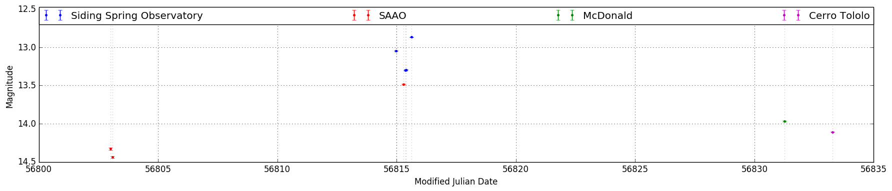
