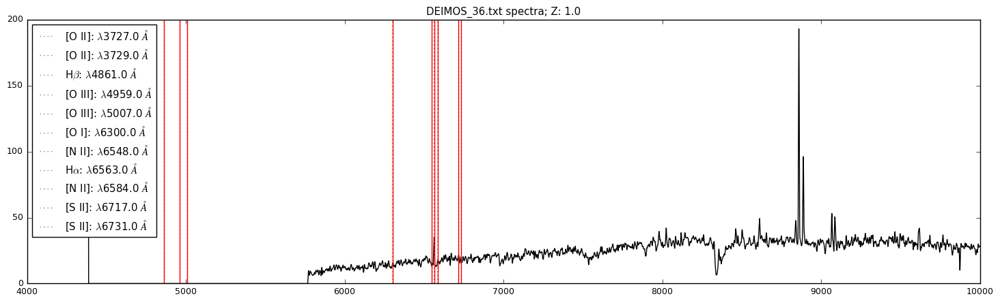
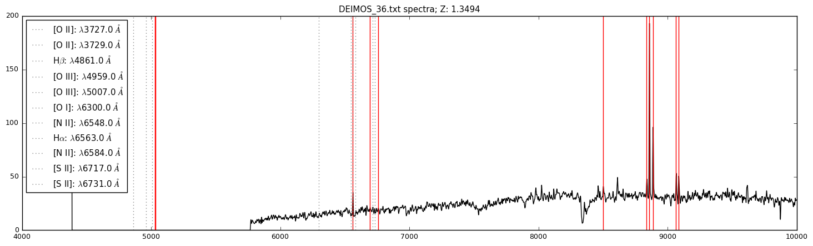
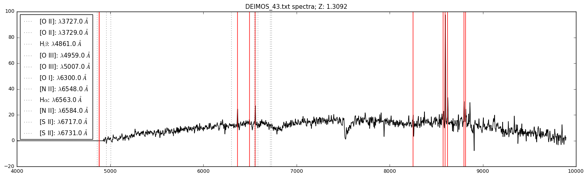
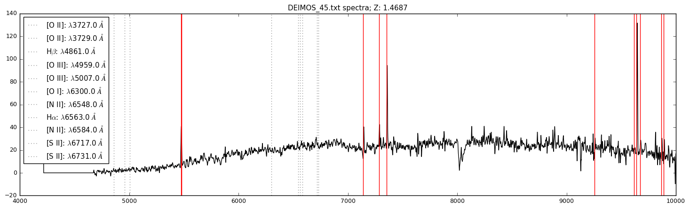
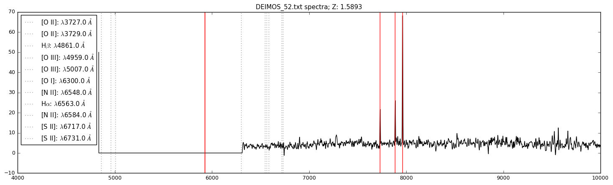
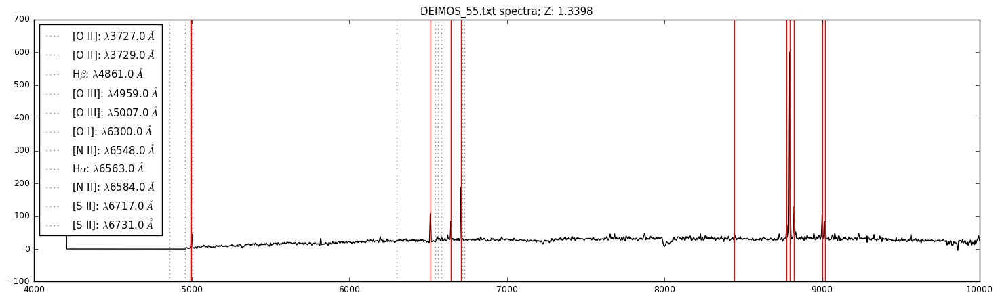
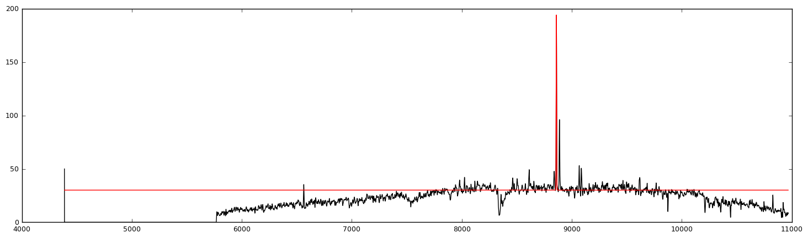

Lab 6 for Observational Astronomy Lab, Galactic Redshifts

Click [HERE](A6.pdf) to see report.

- - -
# Results:
    
Redshift Calculations:
    
| Spectrum File Name | Redshift | Error |
| :-------------: |:-------------:| :-----:|
| "DEIMOS_36" | 0.3494 | 0.002 |
| "*_43" | 0.3092 | 0.002|
| "*_45" | 0.4687 | 0.002|
| "*_52" | 0.5893 | 0.002|
| "*_55" | 0.3398 | 0.002|

Rotational Velocity

| Spectrum | FWHM | Rotational Velocity|
| :---------: |:-------:| :-------------:|
| DEIMOS_36 | 5.3864 +/- 0.0007 | 182247 +/- 25 \[m/s] = (1.0956+/-0.0002e+12 \[furlongs/fortnight]

See code for analyses below...


```python
import os
import numpy as np
import matplotlib.pyplot as plt
from scipy.optimize import curve_fit
from pylab import rcParams
from uncertainties import ufloat


rcParams['figure.figsize'] = 18, 5
rcParams.update({'font.size': 9})
```


```python
## -- Calculate redshifted lines
def red_shift(element, z):
    return np.array(np.float(element))*z + z

## -- Plot vertical lines at emission lines
def plot_lines(element_list, shift):  
    for i in xrange(len(element_list)):
        ## -- Uncorrected
        plt.axvline(x=element_list[i][0], color="grey",
                   linestyle=":",
                   label = (str(element_list[i][1])+
                            ": $\lambda$"+str(element_list[i][0])+
                            " $\AA$"))
        ## -- Corrected
        plt.axvline(x=red_shift(element_list[i][0], shift), color="r")
```


```python
def main(in_data, redshift):
    global data_dir
    global out_dir
    
    data = np.genfromtxt(data_dir+in_data, delimiter=", ")
    wavelen = data[:,0]
    counts = data[:,1]
                         
    #red_list = np.arange(1.2, 1.7, 0.002)
    
    #for item in red_list:
    plt.clf()
    plt.plot(wavelen, counts, 'k-')

    plot_lines(linelist, redshift) 
    
    plt.xlim(4000,10000)
    plt.title(in_data+" spectra; Z: "+str(redshift))
    plt.legend(loc=2)
    plt.savefig(out_dir+" "+in_data[0:-2]+" "+"Z: "+str(redshift)+".png")
    plt.show() ; plt.close()
```

## Directory Tree


```python
main_dir = "/Users/kaimibk/Desktop/ASTR300L/A6/"
data_dir = main_dir+"spectra/"
out_dir = main_dir+"out/"

if not os.path.exists(out_dir):
    os.makedirs(out_dir)
```


```python
## -- list of spectral lines to inspect
linelist = np.array([[3727.,'[O II]'], [3729.,'[O II]'], [4861.,'H$\\beta$'], 
[4959.,'[O III]'], [5007.,'[O III]'], [6300.,'[O I]'], 
[6548.,'[N II]'], [6563.,'H$\\alpha$'], [6584.,'[N II]'], 
[6717.,'[S II]'], [6731.,'[S II]']])

```


```python
for filename in os.listdir(data_dir):
    if filename.endswith(".txt"):
    
        ## --- The following block is used to input redshift
        ## --- values to find the correct shift
        #'''
        response = "1.0" ## start with z=1.0
        
        while response != "q":
            rs = float(response)
            main(filename, rs)
            
            response = input('New redshift: (q to exit): ') ## try new z
        #'''
```





## Redshifts
I manually wrote down the z values from the plots
* D_36 : z=1.3494 $\pm$ 0.002
* D_43 : z=1.3092 $\pm$ 0.002
* D_45 : z=1.4687 $\pm$ 0.002
* D_52 : z=1.5893 $\pm$ 0.002
* D_55 : z=1.3398 $\pm$ 0.002


```python
## -- Plot again, but with correct z values 
## -- manually entered in array below
redshifts = (1.3494, 1.3092, 1.4687, 1.5893, 1.3398)

q = 0

for filename in os.listdir(data_dir):
    
    if filename.endswith(".txt"):
        
        main(filename, redshifts[q])
        
        q+=1
```

















## Gaussian Fitting for D_36.txt


```python
def Gaussian(x, mu, sigma, b, sc):
    return (0.39894/sigma)*np.exp(-(x-mu)**2/(2*sigma**2))*sc + b
```


```python
data = np.genfromtxt(data_dir+"DEIMOS_36.txt", 
                     delimiter=", ")

wavelen = data[:,0]
counts = data[:,1]

## -- Selecting region around Halpha line
## -- for example 8850 <= X <= 8870
index = np.where(np.logical_and(wavelen>=8850, 
                                wavelen<= 8870))

trim_wavelen = wavelen[index]
trim_counts = counts[index]

## -- Initial guess p0=[mu, sigma, b, sc] 
## -- mu roughly where max is located

popt, pcov = curve_fit(Gaussian, trim_wavelen, 
                       trim_counts, p0=[8860, 2, 1, 5])

plt.plot(wavelen, counts, 'k-')
plt.plot(wavelen, Gaussian(wavelen, *popt), "r")

plt.show() ; plt.close()
```





```python
mu = ufloat(popt[0], pcov[0,0])
sigma = ufloat(popt[1], pcov[1,1])

FWHM = 2.35*sigma
print("Full Width Half Max: {}").format(FWHM)

V = 299782458.0*FWHM / mu ## velocity

print("Velocity: {} [m/s]").format(V)
print('\t = {} [furlongs/fortnight]').format((6.013e+6)*V)
#V = c*delta_lambda / lamba
```

    Full Width Half Max: 5.3864+/-0.0007
    Velocity: 182247+/-25 [m/s]
    	 = (1.09585+/-0.00015)e+12 [furlongs/fortnight]


